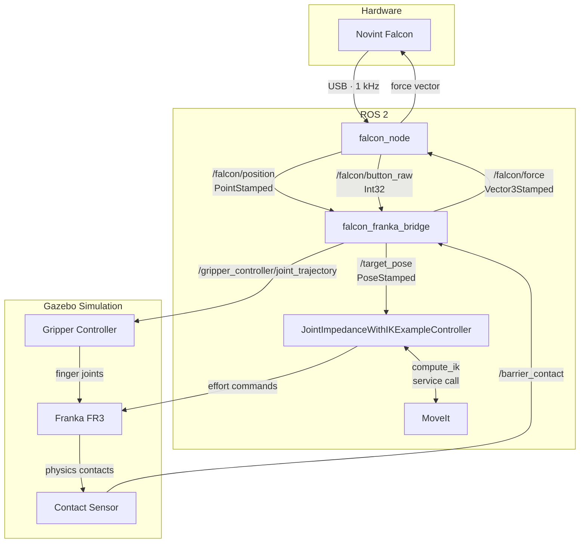

# Franka FR3 + Novint Falcon Haptic Teleoperation (ROS 2)

A ROS 2 Humble workspace for teleoperating a Franka FR3 robot arm using a Novint Falcon haptic device. The Falcon's position is mapped to Cartesian commands for the robot, with full haptic force feedback driven by Gazebo physics contacts in simulation.

---

## Haptic Controller Overview

The system lets you physically move the Novint Falcon's end-effector and have the simulated Franka FR3 arm track your hand in real time. When the robot's end-effector touches a physical obstacle in Gazebo, the Falcon pushes back against your hand with a proportional force — closing the haptic feedback loop.

### How It Works



### Packages

| Package | Description |
|---|---|
| `falcon_ros2` | ROS 2 node for the Novint Falcon. Publishes end-effector position and button states, applies force commands via libnifalcon at 1000 Hz. |
| `franka_falcon_haptic_control` | Bridge node. Maps Falcon position to Franka Cartesian targets, reads Gazebo contact data, computes haptic feedback forces. |
| `franka_example_controllers` | Upstream Franka controllers, including `JointImpedanceWithIKExampleController` — subscribes to `/target_pose` and drives joints via MoveIt IK + PD effort control. |
| `franka_gazebo` | Gazebo Sim (Ignition) integration for the FR3: spawns the robot, loads ros2_control, and provides the simulation environment. |

### Simulation Components

#### 1. Novint Falcon Node (`falcon_ros2`)

- Connects to the Falcon over USB using **libnifalcon** with the `FalconCommLibUSB` backend
- Loads the Novint firmware (`nvent_firmware.bin`) on startup
- Runs a 1000 Hz control loop: applies the latest force command → runs the IO loop → reads position and button state
- LED feedback: red = not homed, green = homed
- Publishes:
  - `/falcon/position` (`geometry_msgs/PointStamped`) — 3-axis end-effector position in metres
  - `/falcon/button_raw` (`std_msgs/Int32`) — bitmask for the four grip buttons (1=plus, 2=forward, 4=center, 8=minus)
- Subscribes to `/falcon/force` (`geometry_msgs/Vector3Stamped`) and feeds it directly to the device actuators

#### 2. Falcon–Franka Bridge (`franka_falcon_haptic_control`)

**Workspace mapping** — The Falcon's small physical workspace is scaled up to the Franka's reachable space:

| Falcon axis | Franka axis | Scale (default) |
|---|---|---|
| Falcon X | Franka Y (negated) | 5× |
| Falcon Y | Franka Z | 5× |
| Falcon Z (relative to rest) | Franka X (negated) | 5× |

The Falcon rests at `z = 0.125 m` when homed; this offset is subtracted so the Franka target stays at its center position when the Falcon is at rest.

**Gripper control** — Pressing the center button on the Falcon grip toggles the simulated FR3 gripper open/closed. Commands are sent directly to the `gripper_controller/joint_trajectory` topic with a 2.5-second cooldown to prevent chatter.

**Haptic force feedback** — The bridge subscribes to `/barrier_contact`, which carries physics contact data from a Gazebo contact sensor placed on a 0.3 m cube obstacle in the robot's workspace. On each 100 Hz timer tick:

1. Contact normals from the physics engine are summed and averaged across all active contact points
2. The resulting normal vector is rotated from Franka world frame to Falcon force frame using the known axis mapping
3. The force is clamped to 3 N per axis (Falcon peak is ~8.9 N total)
4. If no fresh contact message arrives within 50 ms, the force is zeroed
5. A fallback using contact *positions* (relative to the cube centre) is used when the physics engine does not populate normals — each axis is handled independently so edge/corner contacts produce simultaneous forces on multiple axes

**Published targets** — Each tick publishes a `geometry_msgs/PoseStamped` on `/target_pose` in the `fr3_link0` frame with a fixed end-effector orientation matching the FR3's default joint configuration (RPY ≈ 180°, 0°, −45°).

#### 3. Joint Impedance + IK Controller

The `JointImpedanceWithIKExampleController` (from `franka_example_controllers`) receives `/target_pose` and:

- Calls MoveIt's IK service (via a `move_group` node running kinematics-only) to convert the Cartesian target into 7-DOF joint angles
- Applies a PD joint impedance law in joint space to track those angles via effort commands
- In Gazebo mode the controller reads joint position/velocity/effort directly from ros2_control state interfaces (no Franka-specific hardware interfaces required)

#### 4. Gazebo Simulation Environment

The `gazebo_falcon_haptic_control.launch.py` brings up the full simulation stack:

- **Gazebo Sim** (Ignition) with an empty world
- **Franka FR3 URDF** spawned with gripper, gazebo effort mode, and ros2_control hardware interface
- **ros2_control** loading: `joint_state_broadcaster`, `joint_impedance_with_ik_example_controller`, and `gripper_controller`
- **Barrier cube** (0.3 m × 0.3 m × 0.3 m, static, blue) spawned at position (0.6, 0.0, 0.4) in the robot's workspace — directly in front of the arm's default reach
- **Contact sensor** on the barrier at 100 Hz, bridged to ROS 2 via `ros_gz_bridge` on `/barrier_contact`
- **MoveIt move_group** node for IK (kinematics-only, no hardware interface)

#### 5. Topic Map

| Topic | Type | Direction |
|---|---|---|
| `/falcon/position` | `geometry_msgs/PointStamped` | Falcon → Bridge |
| `/falcon/button_raw` | `std_msgs/Int32` | Falcon → Bridge |
| `/falcon/force` | `geometry_msgs/Vector3Stamped` | Bridge → Falcon |
| `/target_pose` | `geometry_msgs/PoseStamped` | Bridge → IK Controller |
| `/gripper_controller/joint_trajectory` | `trajectory_msgs/JointTrajectory` | Bridge → Gazebo |
| `/barrier_contact` | `ros_gz_interfaces/Contacts` | Gazebo → Bridge |
| `/joint_states` | `sensor_msgs/JointState` | Gazebo → ROS 2 |

#### 6. Configurable Parameters (bridge node)

| Parameter | Default | Description |
|---|---|---|
| `franka_center_x/y/z` | 0.5 / 0.0 / 0.4 | Franka workspace center in `fr3_link0` frame |
| `scale_x/y/z` | 5.0 / 5.0 / 5.0 | Workspace scaling factors |
| `falcon_rest_z` | 0.125 | Falcon Z offset at rest position (homed) |
| `loop_rate_hz` | 100.0 | Bridge control loop rate |
| `position_deadband` | 0.001 | Minimum position change before publishing target |
| `ee_orientation_w/x/y/z` | 0.001 / 0.924 / −0.383 / −0.002 | Fixed end-effector orientation quaternion |

---

## Setup Instructions (Dual Boot)

These instructions set up Ubuntu 22.04 alongside an existing OS (Windows or another Linux) on the same machine.

### Step 1: Prepare a bootable Ubuntu 22.04 USB

1. Download the Ubuntu 22.04 LTS ISO from [ubuntu.com/download/desktop](https://ubuntu.com/download/desktop)
2. Flash it to a USB drive (8 GB+) using [Balena Etcher](https://etcher.balena.io/) or `dd`
3. **On Windows:** shrink your existing partition first
   - Open Disk Management → right-click your C: drive → Shrink Volume
   - Free up at least 50 GB (100 GB+ recommended for ROS 2 + Gazebo)

### Step 2: Install Ubuntu 22.04

1. Boot from the USB (enter BIOS/UEFI and set USB as first boot device; disable Secure Boot if needed)
2. Select **Install Ubuntu alongside Windows** (or manual partitioning if on Linux)
3. Complete the installation — Ubuntu installs its own GRUB bootloader so you can choose the OS at every startup
4. Reboot into Ubuntu

### Step 3: System update and base dependencies

```bash
sudo apt update && sudo apt upgrade -y
sudo apt install -y \
    git \
    curl \
    wget \
    build-essential \
    cmake \
    libusb-1.0-0-dev \
    python3-pip \
    python3-colcon-common-extensions \
    python3-rosdep \
    python3-vcstool
```

### Step 4: Install ROS 2 Humble

```bash
# Add ROS 2 apt repository
sudo apt install -y software-properties-common
sudo add-apt-repository universe
sudo curl -sSL https://raw.githubusercontent.com/ros/rosdistro/master/ros.key \
    -o /usr/share/keyrings/ros-archive-keyring.gpg
echo "deb [arch=$(dpkg --print-architecture) signed-by=/usr/share/keyrings/ros-archive-keyring.gpg] \
    http://packages.ros.org/ros2/ubuntu $(. /etc/os-release && echo $UBUNTU_CODENAME) main" \
    | sudo tee /etc/apt/sources.list.d/ros2.list > /dev/null

sudo apt update
sudo apt install -y ros-humble-desktop ros-humble-ros-gz ros-humble-moveit
```

Source ROS 2 in every terminal (add to `~/.bashrc`):

```bash
echo "source /opt/ros/humble/setup.bash" >> ~/.bashrc
source ~/.bashrc
```

### Step 5: Install libnifalcon (Novint Falcon library)

libnifalcon is the open-source driver for the Novint Falcon. Build it from source:

```bash
sudo apt install -y libboost-all-dev libusb-1.0-0-dev cmake
git clone https://github.com/libnifalcon/libnifalcon.git ~/libnifalcon_src
cd ~/libnifalcon_src
mkdir build && cd build
cmake .. -DBUILD_TESTING=OFF
make -j$(nproc)
sudo make install
sudo ldconfig
```

The build system for `falcon_ros2` expects the libnifalcon headers and libraries in a specific layout. Create the expected directory:

```bash
mkdir -p ~/NovintFalcon/EXTERNAL/include
mkdir -p ~/NovintFalcon/EXTERNAL/lib

# Copy headers
cp -r ~/libnifalcon_src/include/falcon ~/NovintFalcon/EXTERNAL/include/

# Copy libraries
cp ~/libnifalcon_src/build/lib/libnifalcon*.so ~/NovintFalcon/EXTERNAL/lib/
```

**You also need the Novint firmware file** (`nvent_firmware.bin`). This is proprietary and ships with the original Novint software. Place it at:

```
~/NovintFalcon/nvent_firmware.bin
```

Update the firmware path in `src/falcon_ros2/src/falcon_node.cpp` line 40 if your path differs from `/home/<user>/NovintFalcon/nvent_firmware.bin`, or pass it as a parameter at runtime.

### Step 6: Add Falcon USB permissions (udev rule)

```bash
echo 'SUBSYSTEM=="usb", ATTRS{idVendor}=="0403", ATTRS{idProduct}=="cb48", MODE="0666"' \
    | sudo tee /etc/udev/rules.d/99-novint-falcon.rules
sudo udevadm control --reload-rules && sudo udevadm trigger
```

### Step 7: Clone this repository

```bash
git clone <this-repo-url> ~/franka_ros2_ws
cd ~/franka_ros2_ws
```

### Step 8: Install ROS dependencies with rosdep

```bash
cd ~/franka_ros2_ws
sudo rosdep init   # skip if already done
rosdep update
rosdep install --from-paths src --ignore-src -r -y
```

### Step 9: Build the workspace

```bash
cd ~/franka_ros2_ws
source /opt/ros/humble/setup.bash
colcon build --cmake-args -DCMAKE_BUILD_TYPE=Release
```

If your libnifalcon install is **not** at `~/NovintFalcon/EXTERNAL`, pass the path explicitly:

```bash
colcon build --cmake-args -DCMAKE_BUILD_TYPE=Release -DNIFALCON_ROOT=/your/path/to/nifalcon
```

To rebuild only the custom packages after code changes:

```bash
colcon build --packages-select falcon_ros2 franka_falcon_haptic_control
```

### Step 10: Source the workspace

```bash
source ~/franka_ros2_ws/install/setup.bash
```

Add to `~/.bashrc` to source automatically:

```bash
echo "source ~/franka_ros2_ws/install/setup.bash" >> ~/.bashrc
```

---

## Running the Simulation

Launch the full haptic teleoperation simulation (Gazebo + Falcon node + bridge + IK controller):

```bash
ros2 launch franka_gazebo_bringup gazebo_falcon_haptic_control.launch.py
```

This starts:
- Gazebo Sim with the FR3 robot
- The barrier cube obstacle with contact sensor
- The Novint Falcon hardware node
- The Falcon–Franka bridge with haptic feedback
- MoveIt move_group for IK

**Homing the Falcon:** After launch, the Falcon LED will be red. Pull the grip outward then push it back in — the LED turns green and position tracking begins.

**Gripper:** Press the center button on the Falcon grip to toggle the simulated gripper open/closed.


---

## Falcon Workspace Reference

```
-0.062 < x < 0.062 m
-0.058 < y < 0.058 m
 0.075 < z < 0.175 m
```

### Button bitmask

| Button | Bit |
|---|---|
| plus (right) | 1 |
| forward (up) | 2 |
| center (middle) | 4 |
| minus (left) | 8 |

Check a button: `raw_value & button_bit` → non-zero if pressed.

---


## License

- `falcon_ros2`: BSD
- `franka_falcon_haptic_control`: Apache-2.0
- Upstream franka_ros2 packages: Apache-2.0
